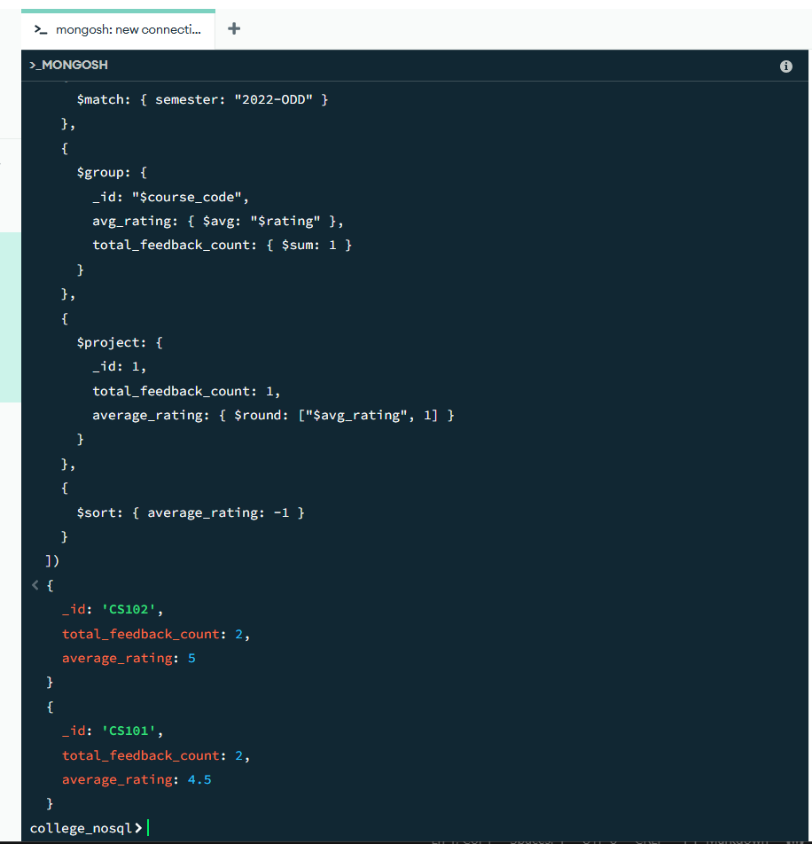
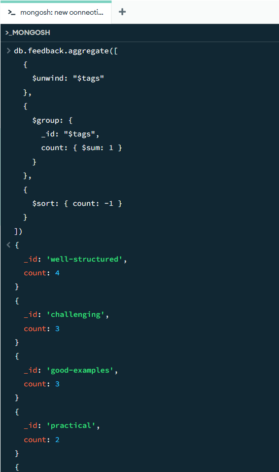
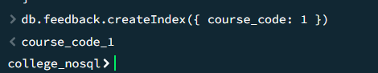
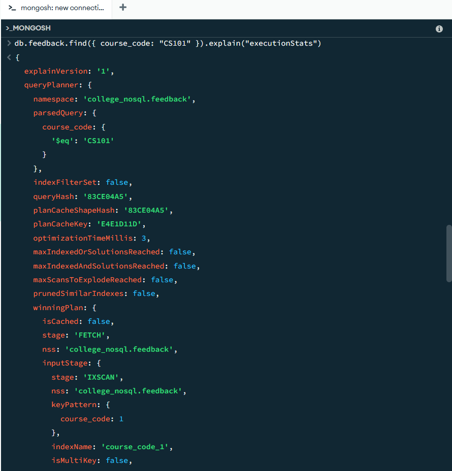

```
db.feedback.aggregate([
  { 
    $match: { semester: "2022-ODD" } 
  },
  
  { 
    $group: { 
      _id: "$course_code", 
      avg_rating: { $avg: "$rating" }, 
      total_feedback_count: { $sum: 1 } 
    } 
  },
  
  { 
    $project: { 
      _id: 1, 
      total_feedback_count: 1, 
      average_rating: { $round: ["$avg_rating", 1] } 
    } 
  },
  
  { 
    $sort: { average_rating: -1 } 
  }
])
```






